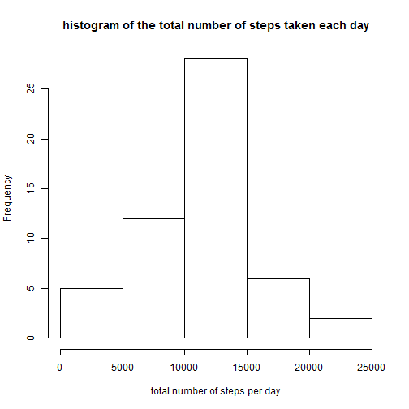
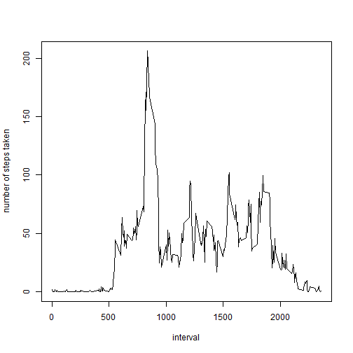
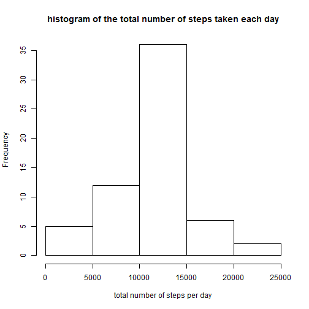
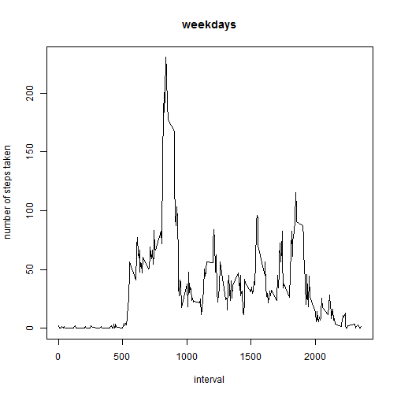
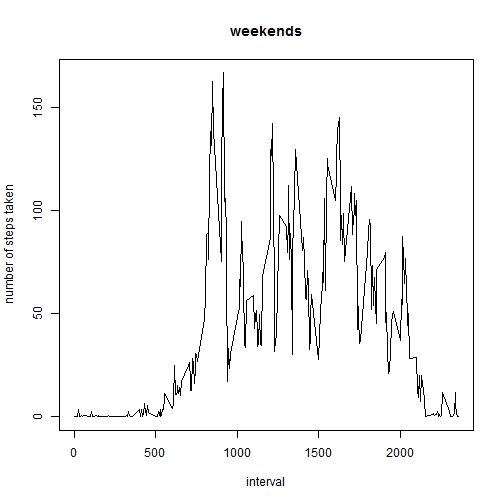
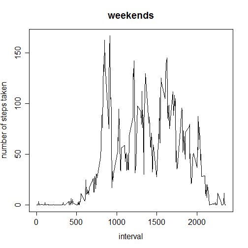

###Loading and preprocessing the data

First we will start by loading the data from activity.csv file and computer any preprocessing.

```r
library(knitr)
library(markdown)

myData <- read.csv("activity.csv", header=TRUE)
```

Now, remove any NA values:

```r
myFilteredData <- myData[complete.cases(myData),]
```


###What is mean total number of steps taken per day?

In order to compute the mean total number of steps taken per day, we will ignore any missing values (e.g. NA):


```r
mySums <- tapply(myFilteredData$steps, myFilteredData$date, sum, na.rm=T)
mySumsFiltered <- mySums[complete.cases(mySums)]
```

Next, we will look at the histogram of the data totals previously computed.

 

Calculate and report the mean and median total number of steps taken per day:

```r
mean(mySumsFiltered)
```

```
## [1] 10766
```


```r
median(mySumsFiltered)
```

```
## [1] 10765
```


###What is the average daily activity pattern?


Create a time series plot (i.e. type = "l") of the 5-minute interval (x-axis) and the average number of steps taken, averaged across all days (y-axis):

```r
myDailyAverage <- tapply(myFilteredData$steps, myFilteredData$interval, mean)
myFilteredDailyAverage <- myDailyAverage[complete.cases(myDailyAverage)]
df<-data.frame(as.numeric(rownames(myFilteredDailyAverage)),myFilteredDailyAverage)
colnames(df)[1]="interval"
colnames(df)[2]="number_of_steps"
myMatrix <- as.data.frame.matrix(df)
myXVector <- myMatrix$interval
myYVector <- myMatrix$number_of_steps
```

And now, create the graph:
  
 

Which 5-minute interval, on average across all the days in the dataset, contains the maximum number of steps?


```r
index <- which.max(myMatrix$number_of_steps)
myMatrix[index,]
```

```
##     interval number_of_steps
## 835      835           206.2
```

###Imputing missing values

Calculate and report the total number of missing values in the dataset (i.e. the total number of rows with NAs):


```r
nrow(subset(myData, is.na(myData$steps)))
```

```
## [1] 2304
```

For all the missing values, we will create a strategy to fill with the value of the mean for that 5-minute interval. We will create a new dataset similar to the original one, but with the missing values replaced.


```r
myNewData <- myData
for(i in 1:nrow(myNewData)){
  if(is.na(myNewData[i,1]) == TRUE){
    myIndex <- which(myXVector == myNewData[i,3], arr.in = TRUE)[1]
    if (is.na(myIndex) == TRUE)
      myNewData[i,1] <- 0
    else{
      myNewData[i,1] <- myYVector[myIndex]
    }
  }
  
}
```

Next, we will create a histogram of the total number of steps taken each day and calculate and report the mean and median total number of steps taken per day.


```r
myNewSums <- tapply(myNewData$steps, myNewData$date, sum, na.rm=T)
```

 

Calculate and report the mean and median total number of steps taken per day:

```r
mean(myNewSums)
```

```
## [1] 10766
```


```r
median(myNewSums)
```

```
## [1] 10766
```

Both mean values (from the first part of the assignment and after we've replaced the missing values) are identical. But, we do see a slightly inccrease in the median values (10766 from now compared to 10765 that was originaly). 

The impact of imputing missing data on the estimates of the total daily number of steps is insignificant.

###Are there differences in activity patterns between weekdays and weekends?

First, we'll create two new variables to hold the weekdays and weekends:


```r
myWeekdays <- c("Monday","Tuesday","Wednesday","Thursday","Friday")
myWeekends <- c("Saturday","Sunday")
```

Calculate the average number of steps taken, averaged across all weekday days or weekend days


```r
myWeekDayDataForWeekdays <- subset(myNewData, weekdays(as.Date(myNewData$date)) %in% myWeekdays)
myDailyNewAverageForWeekdays <- tapply(myWeekDayDataForWeekdays$steps, myWeekDayDataForWeekdays$interval, mean)
myNewDataFrameForWeekdays<-data.frame(rownames(myDailyNewAverageForWeekdays),myDailyNewAverageForWeekdays)
colnames(myNewDataFrameForWeekdays)[1]="interval"
colnames(myNewDataFrameForWeekdays)[2]="number_of_steps"
myNewMatrixForWeekdays <- as.data.frame.matrix(myNewDataFrameForWeekdays)
myNewXVectorForWeekdays <- myNewMatrixForWeekdays$interval
myNewYVectorForWeekdays <- myNewMatrixForWeekdays$number_of_steps
```


Create the graph for weekdays:

 


```r
myWeekDayDataForWeekends <- subset(myNewData, (weekdays(as.Date(myNewData$date)) %in% myWeekends))
myDailyNewAverageForWeekends <- tapply(myWeekDayDataForWeekends$steps, myWeekDayDataForWeekends$interval, mean)
myNewDataFrameForWeekends<-data.frame(rownames(myDailyNewAverageForWeekends),myDailyNewAverageForWeekends)
colnames(myNewDataFrameForWeekends)[1]="interval"
colnames(myNewDataFrameForWeekends)[2]="number_of_steps"
myNewMatrixForWeekends <- as.data.frame.matrix(myNewDataFrameForWeekends)
myNewXVectorForWeekends <- myNewMatrixForWeekends$interval
myNewYVectorForWeekends <- myNewMatrixForWeekends$number_of_steps
```


Create the graph for weekends:

 


As per previously generated two graphs (for number of steps taken in weekdays versus weekend), we can conclude that there are differences in activity patterns.

Now, we save all the results in the required files:


```r
knit("PA1_template.Rmd")    
```

```
## 
## 
## processing file: PA1_template.Rmd
```

```
## 
  |                                                                       
  |                                                                 |   0%
  |                                                                       
  |..                                                               |   2%
##   ordinary text without R code
## 
## 
  |                                                                       
  |...                                                              |   5%
## label: unnamed-chunk-22
## 
  |                                                                       
  |.....                                                            |   7%
##   ordinary text without R code
## 
## 
  |                                                                       
  |......                                                           |  10%
## label: unnamed-chunk-23
## 
  |                                                                       
  |........                                                         |  12%
##   ordinary text without R code
## 
## 
  |                                                                       
  |.........                                                        |  14%
## label: unnamed-chunk-24
## 
  |                                                                       
  |...........                                                      |  17%
##   ordinary text without R code
## 
## 
  |                                                                       
  |............                                                     |  19%
## label: unnamed-chunk-25 (with options) 
## List of 1
##  $ echo: logi FALSE
```

```
## 
  |                                                                       
  |..............                                                   |  21%
##   ordinary text without R code
## 
## 
  |                                                                       
  |...............                                                  |  24%
## label: unnamed-chunk-26
## 
  |                                                                       
  |.................                                                |  26%
##   ordinary text without R code
## 
## 
  |                                                                       
  |...................                                              |  29%
## label: unnamed-chunk-27
## 
  |                                                                       
  |....................                                             |  31%
##   ordinary text without R code
## 
## 
  |                                                                       
  |......................                                           |  33%
## label: unnamed-chunk-28
## 
  |                                                                       
  |.......................                                          |  36%
##   ordinary text without R code
## 
## 
  |                                                                       
  |.........................                                        |  38%
## label: unnamed-chunk-29 (with options) 
## List of 1
##  $ echo: logi FALSE
```

```
## 
  |                                                                       
  |..........................                                       |  40%
##   ordinary text without R code
## 
## 
  |                                                                       
  |............................                                     |  43%
## label: unnamed-chunk-30
## 
  |                                                                       
  |.............................                                    |  45%
##   ordinary text without R code
## 
## 
  |                                                                       
  |...............................                                  |  48%
## label: unnamed-chunk-31
## 
  |                                                                       
  |................................                                 |  50%
##   ordinary text without R code
## 
## 
  |                                                                       
  |..................................                               |  52%
## label: unnamed-chunk-32
## 
  |                                                                       
  |....................................                             |  55%
##   ordinary text without R code
## 
## 
  |                                                                       
  |.....................................                            |  57%
## label: unnamed-chunk-33
## 
  |                                                                       
  |.......................................                          |  60%
##   ordinary text without R code
## 
## 
  |                                                                       
  |........................................                         |  62%
## label: unnamed-chunk-34 (with options) 
## List of 1
##  $ echo: logi FALSE
```

```
## 
  |                                                                       
  |..........................................                       |  64%
##   ordinary text without R code
## 
## 
  |                                                                       
  |...........................................                      |  67%
## label: unnamed-chunk-35
## 
  |                                                                       
  |.............................................                    |  69%
##   ordinary text without R code
## 
## 
  |                                                                       
  |..............................................                   |  71%
## label: unnamed-chunk-36
## 
  |                                                                       
  |................................................                 |  74%
##   ordinary text without R code
## 
## 
  |                                                                       
  |..................................................               |  76%
## label: unnamed-chunk-37
## 
  |                                                                       
  |...................................................              |  79%
##   ordinary text without R code
## 
## 
  |                                                                       
  |.....................................................            |  81%
## label: unnamed-chunk-38
## 
  |                                                                       
  |......................................................           |  83%
##   ordinary text without R code
## 
## 
  |                                                                       
  |........................................................         |  86%
## label: unnamed-chunk-39 (with options) 
## List of 1
##  $ echo: logi FALSE
```

```
## 
  |                                                                       
  |.........................................................        |  88%
##   ordinary text without R code
## 
## 
  |                                                                       
  |...........................................................      |  90%
## label: unnamed-chunk-40
## 
  |                                                                       
  |............................................................     |  93%
##   ordinary text without R code
## 
## 
  |                                                                       
  |..............................................................   |  95%
## label: unnamed-chunk-41 (with options) 
## List of 1
##  $ echo: logi FALSE
```

```
## 
  |                                                                       
  |...............................................................  |  98%
##   ordinary text without R code
## 
## 
  |                                                                       
  |.................................................................| 100%
## label: unnamed-chunk-42
```

```
## output file: PA1_template.md
```

 

```
## [1] "PA1_template.md"
```

```r
markdownToHTML("PA1_template.md", output="PA1_template.html")
```
